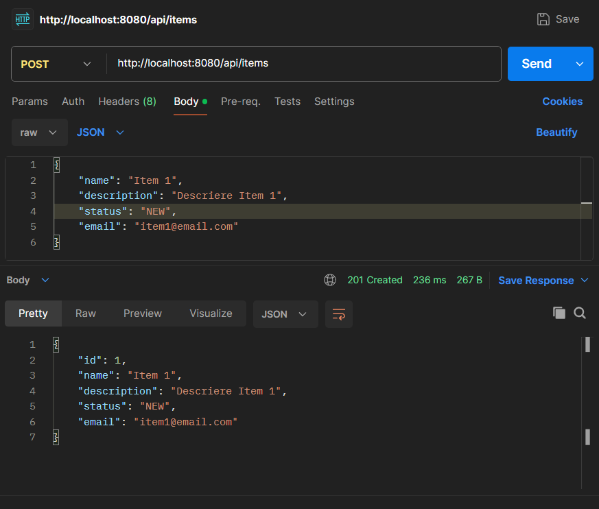
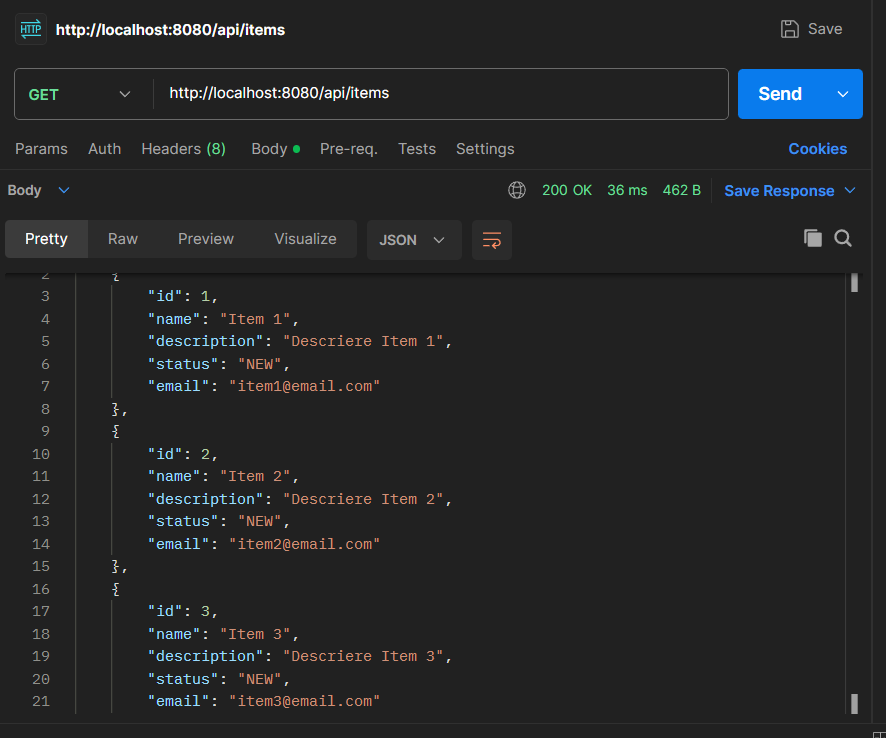
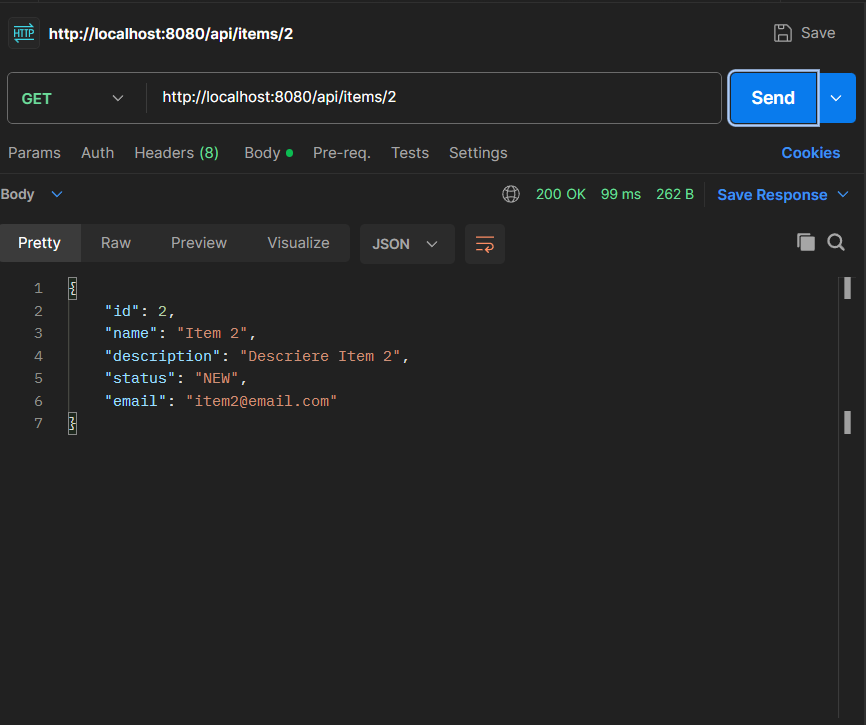
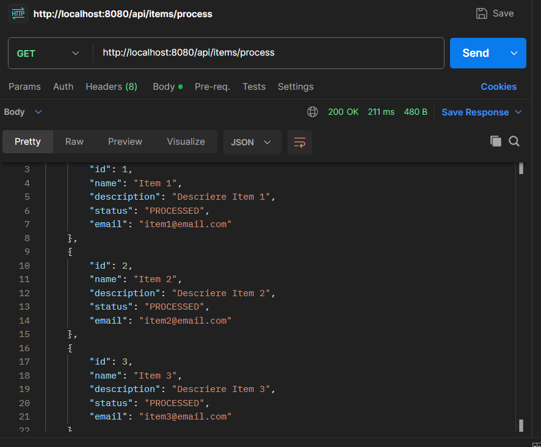
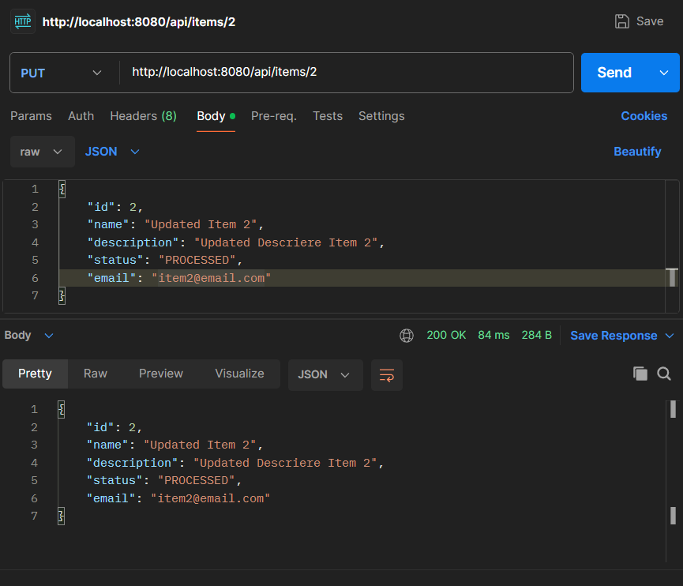
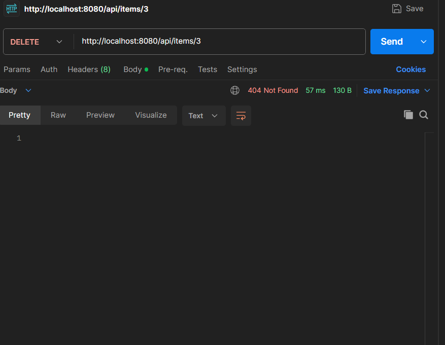
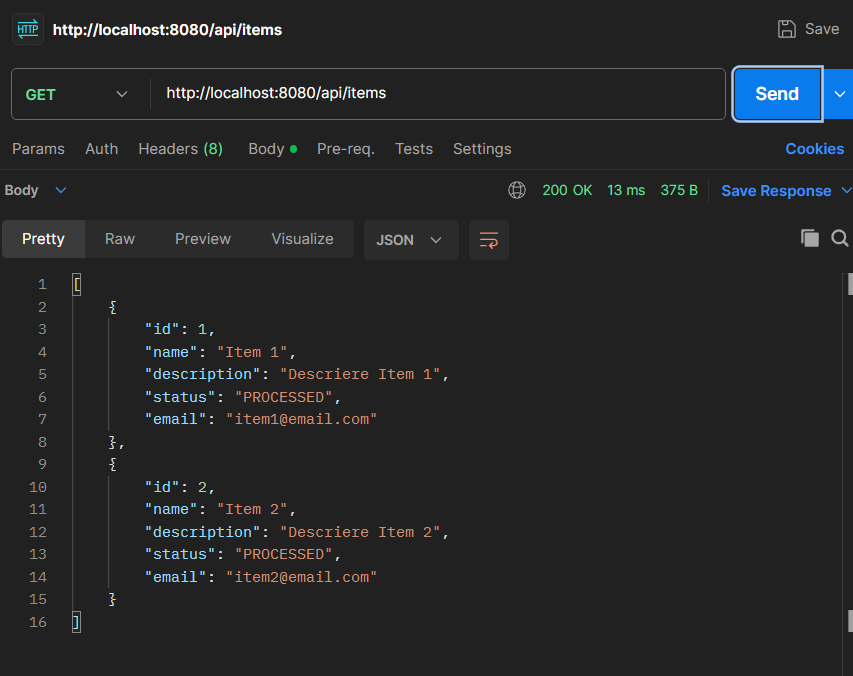

# Siemens Java Internship

This is a Spring Boot CRUD application implemented as part of the Siemens internship challenge.  
The goal was to refactor and improve a basic application while ensuring code quality, validation, proper status codes, and testing.

---

## ✅ Features

- Full CRUD operations for `Item` entities
- Validation using `@Valid`, `@NotBlank`, `@Email`
- Asynchronous processing with `CompletableFuture`
- Thread-safe logic and exception handling
- Proper HTTP status codes (200, 201, 400, 404, 204)
- Unit, integration and performance tests with JUnit 5
- In-memory H2 database (no setup required)
- Manual testing via Postman (screenshots available)

---

## 🛠 Technologies Used

- Java 17
- Spring Boot
- Spring Web + Validation
- Spring Data JPA
- H2 Database
- JUnit 5
- Postman

---

## 🚀 How to Run

```bash
mvn spring-boot:run
```

🔗 API Endpoints

| Method | Endpoint             | Description                       |
| ------ | -------------------- | --------------------------------- |
| GET    | `/api/items`         | List all items                    |
| POST   | `/api/items`         | Create new item (with validation) |
| GET    | `/api/items/{id}`    | Get item by ID                    |
| PUT    | `/api/items/{id}`    | Update existing item              |
| DELETE | `/api/items/{id}`    | Delete item                       |
| GET    | `/api/items/process` | Asynchronously process all items  |


## 📸 Postman Screenshots

### 🔹 Create New Item


### 🔹 Get All Items


### 🔹 Get Item By ID


### 🔹 Process Items


### 🔹 Update Item


### 🔹 Delete Item


### 🔹 After Delete Item



